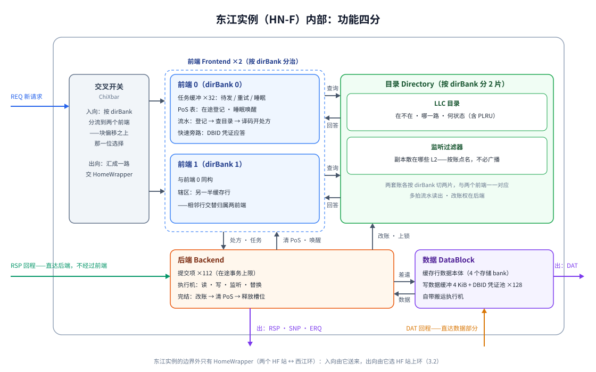

# 珠江（ZhuJiang）原理

> 一本关于香山（XiangShan）昆明湖 V3 "L3 Cache + 片上互连"子系统的入门读物。
> 视角：高层抽象，只讲"它由什么组成、各部分如何协作"，不沉入模块实现细节。
> 组织：总分——先总览全局，再分"架构"（静态结构）与"行为"（动态过程）两篇，每篇内部同样按总分递归展开。

## 第 0 章 总览：珠江是什么

### 0.1 定位：存储层次中的珠江

现代多核处理器的存储层次呈金字塔形：金字塔顶端，每个核心拥有私有的 L1 与 L2 缓存，速度快但容量小；金字塔底端，片外内存容量大但慢一个数量级以上。珠江坐落在这个金字塔的腰部——它是**所有核心共享的末级缓存（Last-Level Cache, LLC）**，同时也是**连接各核心缓存与片外世界的片上互连**。

这个定位包含两重身份，缺一不可：

- **作为缓存**，珠江是核心私有缓存与内存之间的最后一道关口。L2 未命中的请求来到这里；若这里也未命中，才付出访问片外内存的代价。它的容量远大于任何一级私有缓存，因此绝大多数访存流量被它吸收，内存带宽得以解放。
- **作为互连**，珠江是多核一致性的汇聚点。同一地址的数据副本可能同时存在于多个核心的私有缓存中，必须有一个全局的权威机构裁决"谁的副本有效、谁该被监听"。珠江扮演这个权威：所有一致性请求都流经它，由它排序、裁决、分发监听。

两重身份对应珠江的两张面孔：向上，它以 CHI 协议的一致性从端（slave）身份面对各核心的 L2；向下，它以 AXI 主端（master）身份访问内存与外设。

### 0.2 一句话架构：西江串珠，东江藏缓存

打开珠江的内部，它的全部结构可以用一句话概括：**一条双向环形总线——西江（XiJiang）——串起若干节点；缓存与一致性的功能集中在其中一类节点——东江（DongJiang，CHI 协议中的全一致性主节点，Home Node Fully-coherent，简称 HN-F 或 HNF）——身上。**

这句话包含三个要点：

- **环是骨架**。所有节点挂在同一条环上；请求、响应、数据都封装成固定格式的包（flit），沿环逐站接力传递。环上没有主次之分，也没有中央仲裁器：增加一个节点，就是多串一站。这种简单的拓扑换来了良好的可扩展性。
- **节点各司其职**。环上的节点按职能分为若干类：有的对接核心的 L2，有的对接内存，有的对接外设，还有的只做打拍延时。完整的节点谱系留待第 1 章，这里只需记住一条原则——**节点之间只通过环对话，除此之外没有别的连线**。
- **缓存住在东江**。LLC 在逻辑上被划分为若干分片，称为 **bank**：每个地址唯一属于一个 bank。每个 bank 由一个东江（HNF）实例实现——东江既是这个分片的存储本体，又是这些地址的一致性裁决点：一笔访存请求的命运——命中还是缺失、需要监听谁——由拥有该地址的东江说了算。

命名本身就暗示着结构：珠江是整个水系，西江是干流河道，东江是沿岸最重要的城邑。0.1 节说，L2 眼中的珠江是"一个单一的一致性端点"；现在可以补上下半句——对内，这个端点由环与东江共同扮演：**环负责把请求送到正确的东江，东江负责给出答案**。

### 0.3 贯穿全书的两个问题与阅读地图

理解了定位（0.1）与骨架（0.2）之后，理解珠江就归结为回答两个问题：

- **数据如何在环上流动？** flit 从哪个节点上环、沿什么路线走、在哪个节点下环？各节点争抢环上资源时如何裁决？
- **一致性如何维持？** 多个 L2 共享同一地址时，谁说了算？缓存命中、缺失、监听、写回各自遵循什么时序？

为了回答它们，本书分两篇，各自递归地按总分展开：**架构篇**（第 1–5 章）先总览层次与节点谱系，再分别解剖环、节点、HNF 与对外接口，回答"有什么"；**行为篇**（第 6–10 章）先描出一笔请求的完整一生，再分别讲解环上运输、HNF 事务、一致性维持与边界行为，回答"怎么动"。

## 第一篇 架构：静态结构

### 第 1 章 架构总览

#### 1.1 三个层次：协议 / 互连 / 功能

珠江的结构可按职责抽象为三个层次：协议层、互连层、功能层。三者构成一种"上下解耦"的关系——互连层为协议层提供与内容无关的运输服务，功能层借协议层与互连层完成设备间的协作。分述如下。

**协议层**定义节点间通信的语义规范，即 CHI 协议。它规定了三件事：

1. **消息类型**：所有通信以消息（message）为单位，按功能分为请求、响应、数据、监听四类，每类消息由一组字段构成（地址、事务类型、一致性状态等）；
2. **编址机制**：CHI 在消息中定义了 SrcID、TgtID 等节点编号（nodeId）字段，位宽可在 7~11 位间配置；任何节点凭编号互相定位。至于具体编号到节点的映射，不属于协议本身，由系统集成时分配（珠江的分配见 1.3）；
3. **事务语义**：规定消息如何组合成完整的访存事务，以及这些事务在一致性上的含义。事务与一致性的概念将在行为篇正式引入（第 6、9 章），此处只需知道：节点间的每一次交互都不是孤立的消息，而是受协议约束的事务的一环。

协议层只定义"说什么"，不规定"怎么送达"。

**互连层**实现消息的物理运输，即西江环。环上的传输单位是 flit——消息在链路上的封装格式：一条消息封装为一个 flit，数据消息由携带数据载荷的数据 flit 传输。互连层对协议层提供一个单一的服务承诺：把 flit 从源 nodeId 运输到目的 nodeId。环根据 flit 中的目的编号决定弹出位置，对其余内容不作解释，也不参与任何事务语义。协议层可以假设运输是可靠的、最终可达的；至于每一跳如何仲裁、如何避免死锁，属于互连层内部的问题（第 7 章）。

**功能层**由挂在环上的各节点构成。节点是协议与设备的转接点：对环侧，它按协议层规范收发消息，并将消息封装为 flit 交给环运输；对设备侧，它驱动某种具体的硬件功能——有的节点对接核心的缓存，有的实现缓存与一致性裁决，有的对接内存与外设。节点的内部实现彼此不可见，协作完全通过协议消息进行。

这种分层的意义在于接口的收敛：三层之间唯一的公共约定是消息的语义与 nodeId 编址。其直接推论是珠江的可扩展性——新增一类节点，只需在环上增设一站、分配一个 nodeId、实现协议层的收发语义，协议层与互连层本身无需任何改动。环上究竟有哪几类节点、按什么顺序排布，由 1.2、1.3 两节给出。

#### 1.2 节点谱系一览

珠江的节点类型沿用 CHI 的节点分类体系，另有一种珠江特有的辅助站。需要说明的是，CHI 定义的节点类型比珠江用到的更多（例如支持 DVM 操作的 RN-D、IO 从节点 SN-I 等），珠江只取其中与"带缓存核心 + 内存 + 外设"这一系统形态相关的六种。在列出珠江的节点之前，先解释这些 CHI 类型本身的语义。

CHI 节点类型的命名遵循"角色字母 + N + 可选后缀"的格式。角色字母表示节点在事务中的位置：
- **R**（Request）发起访存请求；
- **H**（Home）是请求的归宿，负责裁决一致性；
- **S**（Slave）是被 HN 访问的被动端点；
- **M**（Miscellaneous）处理系统级杂务。

后缀表示一致性能力：
- **F**（Fully-coherent）参与全一致性协议；
- **I**（IO）面向无一致性的 IO 域。

珠江用到的六类分别是：
- **RN-F**：全一致性请求节点——持有缓存、发起一致性请求的请求方，在香山中即核心与其 L2 缓存；
- **RN-I**：IO 请求节点——不持有缓存的请求方，如 DMA；它的请求不参与缓存一致性；
- **HN-F**：全一致性主节点——一致性请求的"家"：接收各 RN 的请求、裁决同一地址的访问次序、必要时向持有副本的缓存发起监听；LLC 由它实现；
- **HN-I**：IO 主节点——把一致性域内的请求转接到无一致性的 IO 域（外设）；
- **SN**：从节点——HN 向下游访问的被动端点，通常是内存控制器或外设；
- **MN**：杂项节点——承担系统级杂务；在珠江中负责复位的分发。

珠江的七类节点如下表：

| 类型 | CHI 角色 | 对接对象 | 职责 |
|---|---|---|---|
| CC | RN-F | 单个CPU核心的 L2 缓存 | 一致性请求的出入口 |
| RI | RN-I | DMA 等无缓存主设备 | 无缓存访存请求的入口（当前配置中未启用） |
| HF | HN-F | 东江（HNF） | 东江的环接口站 |
| HI | HN-I | 外设配置总线 | 通往外设（MMIO）的桥 |
| S | SN | 内存 | 通往内存的桥 |
| M | MN | 全局复位逻辑 | 复位分发 |
| P | —（珠江特有） | 无 | 纯打拍站 |

上表的"CHI 角色"一栏需要一点解释。CHI 类型描述的是**逻辑角色**；珠江在物理实现时把其中两种角色拆成了"设备本体 + 环接口"两个部件：RN-F 本体是核心侧的 L2 缓存，CC 只是它挂到环上的门户；HN-F 本体是东江，HF 只是东江挂到环上的接口站。因此在珠江里，一个逻辑角色可以对应两个环上的物理实体。命名上也反映了这一点：CC 与 HF 是珠江为这两个环接口部件起的本地称谓，其余类型则直接沿用 CHI 缩写。

按在一笔事务中的位置，七类节点可以分为三组：

- **发起侧（CC、RI）**：请求进入珠江的门户。它们只发起请求、接收响应与监听，不持有共享数据。
- **应答侧（HF、S、HI）**：请求的目的地。缓存请求经 HF 转入东江；外设与内存请求分别经 HI、S 桥接到珠江之外。
- **辅助（M、P）**：不参与访存事务。P 存在的唯一意义是让环的物理时序成立——环上相邻两站之间必须有寄存，站数不够时用 P 补齐。

下一节给出一个具体配置，看这七类节点在真实的环上如何排布。

#### 1.3 一个具体配置：单核 DefaultConfig 的 10 站环

抽象谱系需要一个实例来落地。本书以香山的单核默认配置（DefaultConfig）为贯穿全书的例子：珠江在这条配置下是一条 **10 站**的环。各站按环上顺序列出如下（环首尾相接，站 9 的下游即站 0）：

| 站序 | nodeId | 类型 | 说明 |
|---|---|---|---|
| 0 | 0x00 | HF | bank0 的接口站之一 |
| 1 | 0x08 | CC | 接核心的 L2 |
| 2 | 0x10 | HF | bank1 的接口站之一 |
| 3 | 0x18 | RI | DMA 入口（本配置未启用） |
| 4 | 0x20 | HI | 外设桥 |
| 5 | 0x28 | HF | bank1 的另一接口站 |
| 6 | 0x30 | S | 内存桥 |
| 7 | 0x38 | HF | bank0 的另一接口站 |
| 8 | 0x40 | M | 复位 |
| 9 | 0x48 | P | 纯打拍 |

从这个实例中可以读出三件事：

- **站数与角色数的差来自 HF**。环上十站，角色只有七类：两个 bank 各占两个接口站，共四站；其余六类角色各占一站。一个 bank 为何需要两个接口站，是第 3 章的话题。
- **nodeId 的分配规律**。本配置中 nodeId 等于站序乘 8：高位是站在环上的编号，低 3 位留给同一物理位置内的子单元（本配置中均为 0）。这正是 1.1 所说的——CHI 只定义编址机制，具体分配由系统集成决定。
- **配置的可伸缩方向**。本配置是单核：一个 CC 对应一个 L2 接入口，两个 bank 分担 LLC。核心数增加时，CC 站随之增加，bank 数与环长也可相应扩展，而协议层与互连层的规则不变——这是 1.1 末尾可扩展性推论的具体体现。

至此，架构总览完成：珠江分协议、互连、功能三层（1.1）；功能层有七类节点（1.2）；它们在单核配置下排成十站的环（1.3）。第 2 章起逐层解剖，先从承载一切的西江环开始。

### 第 2 章 互连：西江环（XiJiang）

#### 2.1 环的基本单元：双向四车道与站

西江环可以直观地想象成一条**环城快速路**：双向，每向四车道（共8车道），沿环路设站，车辆（flit）沿车道单向行驶，从一站到下一站的时间固定。

**车道（channel）**按运载的消息种类划分，四类协议消息各占一条专用车道：

| 车道 | 承载的消息 |
|---|---|
| REQ | 请求（RN 发往 HN） |
| RSP | 响应 |
| DAT | 数据（读数据、写数据同车道） |
| HRQ | HNF 发出的两类消息共用：监听（SNP，发往 RN）与内存请求（ERQ，发往 S） |

分道行驶的用意与马路上的客货分道相同：一类消息的车道拥塞，不会拖住另一类消息。这一性质是协议级防死锁的地基，其完整论证留到第 7、9 章。第四条车道的复用则是一个资源权衡：SNP 与 ERQ 都发自 HNF，共用一条 HRQ 车道可以省下一路独立的物理链路。

四条协议车道运载全部协议交通。此外，站与站之间还并行着一条不起眼的**复位信道**：两位状态随站接力绕环，不运载任何协议消息，职责只有一个——把复位状态送达每一站。它的源头与释放次序是 M 节点的事，见 3.5。

发送方在驶入环路时选择跳数较短的方向，因此双向结构把任意两站间的最坏跳数从"环长减一"减半到"半个环长"。路由规则的细节见 2.3。

**站（stop）**是环路上的位置，好比高速公路上的一个道口：全部车道都从它经过，节点就坐落在道口旁。每条车道经过道口时，独立地呈现两种形态之一：或者是一段**直行道**——车辆通过恰好花费一拍，不做任何加工；或者带一对**出入口**——车辆可以在此驶出车道、交付道口旁的设备，设备发出的车辆也在此驶入车道。一个站内各条车道的形态彼此独立：所有车道都是直行道的站称为**纯打拍站**，至少一条车道带出入口的站称为**功能站**。1.3 的十站配置中，九个功能站加一个 P 站，都是这一基本单元的实例。

#### 2.2 站的内部形态：直行道与出入口

形态的配置依据是"这条车道在本站是否连接设备"：同一个功能站上，与设备相连的车道带出入口，不相连的车道是直行道。本节打开这两种形态的内部。

**直行道**（RingPipe）只供通过：车辆驶入，通过，驶向下一站，全程恰好一拍。它不查看车辆的任何信息，不改变任何内容，唯一的职责是维持"每段一拍"的节拍。

**带出入口**（ChannelTap）是在直行道旁增设一对出入口，供本站设备接收与发出车辆。这套设施包含三个部件，各管一件事：

- **出口（弹出口）**：检查每辆过路车的目的地（目的 nodeId）是否指向本站；若是，引导它驶出车道，交付本站设备。出口不是无条件放行的——设备来不及接收时，车辆只能继续绕环等待下次机会；这套机制与它的防死锁含义留到第 7 章。
- **入口（注入口）**：本站设备要发车时，车辆先在入口排队，等车道上出现空档再汇入车流。过路车与候车谁先行、候车的车会不会永远汇不进去，这些仲裁问题同样留到第 7 章。
- **方向选择**：车辆汇入的那一刻，必须选定顺时针还是逆时针——规则很简单：哪边近走哪边。2.3 把它正式化。

于是，一个功能站在结构上可以理解为"若干直行道 + 若干带出入口的车道"的组合；而整个环，由一张配置表（STOP_TABLE）声明生成：哪一站、哪条车道、挂什么节点，查表即得。换一张表，就是另一个拓扑——环的生成器不变。这是 1.1 可扩展性推论在互连层的具体形态：环本身对节点的种类与数量一无所知。

#### 2.3 路由规则：静态最短路与来源标记

环上的路由决策只发生在两个时刻：**注入时**（选方向）与**经过每一站时**（是否驶出）。两个决策都遵循同一条原则——**静态**：只看 nodeId 与站序，不看当时的拥塞，不做任何动态计算。

**注入时：最短路选向**。车辆从入口汇入前，先比较目的站在顺时针与逆时针两个方向上的跳数，从短的一侧驶入；环是双向的，这一选择一次做出、全程不变——车辆上路后不再转向，只需逐站直行，直到目的站的出口把它拦下。选向所需的信息只有两样：本站站序与目的站序，查表即得。

**过站时：目的地比对**。车辆每经过一个道口，该站的出口都比对一次：车辆的目的 nodeId 是否等于本站编号。相等则驶出，不等则直行。这是环上唯一的"路由表查找"，而且退化为一次相等判断——这正是环形拓扑简单的根源：路径上没有任何中转决策点。

**注入时：盖上来源标记（SrcID）**。车辆驶入车道前，环把它的来源字段改写为本站编号。这个标记回答了协议层的一个关键问题：响应该送回给谁？请求车辆带着来源标记抵达目的站后，应答方只需把响应的目的地填成这个标记，就能原路返回——请求与响应走的是同一张静态地图，谁也不需要在环上维护任何连接状态。

至此，互连层的规则全部讲完：静态的选向、静态的弹出判定、注入时的一枚来源标记。环上不存在动态路由、拥塞感知或连接状态。

#### 2.4 环的设计取舍：为什么用环而不是交叉开关

2.3 结尾说，环的路由简单到近乎简陋。一个自然的疑问是：互连拓扑有那么多选择，珠江为什么选环？本节把环放在候选拓扑的权衡中回答这个问题。

互连拓扑的选择，本质上是在**延迟、带宽、布线代价、可扩展性**四者之间取舍。三种经典候选：

- **总线**：所有设备共享一条通路。结构最简单，但任意时刻全系统只能进行一笔传输，带宽不随规模增长——设备一多就成为瓶颈。
- **交叉开关（crossbar）**：任意两点之间都有直达通路，一跳到达，延迟最低、并发最高。代价是连线数量与仲裁复杂度随节点数**平方**增长；节点稍多，布线本身就在物理上无法收敛。
- **环**：每个站只与左右两个邻居相连。连线复杂度随节点数**线性**增长，布线规则、时序容易收敛；代价是消息平均要走若干跳，且环上带宽由所有站共享。

珠江的选择可以这样论证：

1. **节点规模在环的甜区内**。单核配置十个站，双向结构把最坏跳数压到五跳；即使核数增加、环长加倍，每跳一拍的延迟仍然可控。环的弱点（跳数随环长线性增长）在这个规模下尚未显现。
2. **带宽是够用的**。四类消息分道行驶，等于四条独立的环并行工作；环上带宽按车道分摊，彼此不挤占（2.1）。
3. **物理实现友好**。环形布线规则整齐，每跳一拍的短路径让时序容易收敛；必要时插入纯打拍站调节物理距离即可（1.2 中 P 站的职责）。
4. **可扩展性是免费的**。加一类节点就是在环上多串一站（1.1、2.2）；若换成交叉开关，每加一个节点都要重排全系统的连线。

也要诚实地说出边界：若节点数继续大幅增长，多跳延迟与共享带宽终将成为瓶颈，那时需要二维网格（mesh）一类的拓扑。珠江面向的规模，是环"简单但不凑合"的区间。

第 2 章到此结束：环的骨架是双向四车道（2.1），道口与出入口构成肌理（2.2），路由规则只有静态选向与目的地比对（2.3），拓扑选型是规模与代价的平衡（2.4）。第 3 章沿环走一圈，逐个看道口旁坐落着的节点。

### 第 3 章 节点：环上挂着什么

#### 3.1 CC 节点：对接 L2 的门户

CC 是珠江的北大门——核心的 L2 缓存与环之间的唯一通道。一笔从 L2 出发的请求，在 CC 内顺序经过三道工序：**适配、缓冲、译码**，然后才从入口驶入环路。

**适配：翻译方言**。香山的 L2 与珠江内部说的都是 CHI，但"口音"不同：消息字段的位宽与排布存在差异。CC 的第一道工序是一个无状态的适配器，把 L2 的消息逐字段重映射为环上通行的 flit 格式；反方向的响应、数据、监听做对称的逆向映射。它不存储、不决策，纯粹是格式转换。

**缓冲：弹性交接（socket）**。L2 与环是两个各自独立运转的世界，它们的交接面上设有一道弹性缓冲区，按**信用**（credit）运作：发送方预先持有若干发送额度，每发出一笔消耗一份，接收方腾空资源后归还额度。这道缓冲让两端互相解耦——L2 的短暂停顿不会立刻传导为环上的阻塞，环上出口的拥塞也不会立刻顶死 L2。信用机制如何运作，留到 7.4 详述。

**译码：从地址到目的地**。请求驶入环路之前，必须先回答一个问题：去哪个站？CC 内的一个路由器（RnRouter）查看请求的地址并给出目的 nodeId：普通的缓存地址，按地址中的特定位交织到两个 bank 之一——0.2 那条"每个地址唯一属于一个 bank"的规则，正是在这里执行；落在设备窗口的地址发往 HI 桥；都不匹配的请求发往一个默认节点兜底。译码之后，请求的地址字段保持不变，目的 nodeId 随 flit 上路。

反向路径简单得多：环上弹出的响应、数据与监听经同一道缓冲交还 L2，无需译码——目的地就是 CC 自己。

RI 节点的结构与此相似（3.3）；应答侧那两个"纯粹的桥"（HI、S）在 3.3、3.4；下一节先看谱系中最特殊的一对：HF 与它背后的东江。

#### 3.2 HF 节点与 HomeWrapper：东江的环接口

HF 是东江（HN-F）在环上的接口站。本节把这一带的结构讲清楚：先看东江、HF 站、HomeWrapper 三者的数量与连接关系，再解释为什么这样组织，最后看这套组织如何运转。

东江是缓存本体模块，也是 bank 的实体形态：**bank 与东江实例一一对应，一个 bank 就是一个东江实例**。本配置有两个 bank，所以有两个东江实例。这个模块本身不认识环：它对外的全部接口就是一组普通的 CHI 通道，环有几条车道、多少个站，对它都不可见。把东江接上环，每个东江实例靠一套"两个 HF 站 + 一个 HomeWrapper"的组合：

- **HF 站**：环上的接口站，出入口设施与其他功能站无异。每个东江实例配两个，故环上共四个 HF 站；
- **HomeWrapper**：站后的总装，每个东江实例一个，东江实例就装在它内部。对外伸出两路接口——每路称为一条 **lan**——各连一个 HF 站。

**为什么一个东江实例占两个站。**东江承载着环上最重的流量：所有缓存请求都要到达某个东江实例，所有响应与监听也都由东江实例发出。把这份流量分摊到环上的两个位置，进出带宽翻倍，环上各站到东江实例的平均距离也缩短。代价是东江实例门口需要一套合流与分发的组织——这正是 HomeWrapper 的职责。它的工作可以概括为：入向**合流**、出向**分发**，外加一个发往内存时的**选址**特例。

**入向：合流。**两个 HF 站各自弹出目的地为同一东江实例的车辆，各经一段打拍缓冲后，由 HomeWrapper 轮流仲裁，合流为一路进入东江实例；它看到的是一个统一入口，不知道、也不需要知道一笔请求来自哪条 lan。

**出向：分发。**东江实例发出的每条消息，由 HomeWrapper 选择从哪条 lan 上路：配置时环上的每个站都划归某一条 lan 的覆盖范围，目的地落在谁的范围就从谁发出。分发的同时，消息中用于回程的编号被改写为所选 lan 的站号，使对方的响应能回到同一接口站，再经合流回到东江实例。

**特例：发往内存的选址。**普通消息的目的地由请求本身给定；东江实例发给 S 节点的内存请求（ERQ，走 HRQ 车道）则按地址现场选定目的地：每个 S 节点声明自己负责的地址范围，请求落入谁的范围就发往谁。目的地选定之后，从哪条 lan 上路仍按覆盖范围决定。

对环而言，HF 与其他功能站没有区别：同样的出入口、同样的弹出判定。差异全在站后——两个 HF 站共用一个 HomeWrapper、一个东江实例。东江模块的内部结构，是第 4 章的内容。

#### 3.3 HI / RI 节点：通往外设与 DMA 的桥

环上有两座通往片外的桥，方向相反：应答侧的 **HI** 把环上的请求送出去给外设；发起侧的 **RI** 把片外设备的请求迎进环内。物理实现上，这两座桥与 3.4、3.5 的 S、M 节点被收纳进同一个总装（IoWrapper）；逻辑上它们各占各的站，互不相干。

**HI：外设请求的终点。** 3.1 的译码把落在设备窗口的地址发往 HI——这类请求是处理器对外设的读写（MMIO），不进入缓存。HI 是一座纯粹的翻译桥：

- 环侧，它从出入口接收请求与写数据；设备侧，它把每笔请求翻译成配置总线（AXI-Lite）事务发给外设；
- 外设应答后，它把结果翻译回响应与读数据，经环送还请求方；
- 它自己从不在环上发起请求：对环而言，HI 的请求入口是常闭的。

这正是 CHI 谱系中 HN-I 的含义：IO 域请求的"家"。请求到达 HI 便到了终点；门外是一个没有一致性的世界。

桥内值得一提的只有一处：外设的速度悬殊，一笔慢访问不能堵住后面所有访问，因此桥内备有一组相互独立的事务槽位，多笔外设访问并行推进，各自等待各自的应答。此外它还负责位宽转换——配置总线比环上的数据车道窄，读写数据都要在两种宽度之间拆分或拼接。

**RI：DMA 请求的入口。** RI 与 HI 方向相反：把片外主设备（如 DMA）的请求迎进环内。DMA 不经过任何核心缓存，若放任它直接访问内存，就会与缓存中的副本打架；让它的请求从 RI 进入、经东江裁决，便自动纳入了一致性的管辖。

RI 与 3.1 的 CC 同为发起侧门户，结构同构——适配、缓冲、译码三道工序一道不少，译码用的也是同一张地址地图。差别在两点：

- **适配更重。** CC 两侧都讲 CHI，适配只是重排口音；RI 的门外是讲 AXI 的设备，适配是真正的协议翻译，读、写各设一条独立通路，仲裁后共用一条请求车道上路。
- **不收监听。** RI 身后的设备不持有缓存，任何地址的副本都不会出现在那里，因此它根本不接监听回路——没有人需要监听它。

本配置中 RI 虚位以待：站已占好（1.3 的站 3），端口上却没有挂设备。环对此毫无感知——一个从不发车的入口，与一段直行道无异。

#### 3.4 S 节点：通往内存的桥

当东江实例裁决一笔请求需要访问内存——读缺失要取数、驱逐要写回——它把任务以内存请求（ERQ）的形式发给 S 节点；S 是这条请求链的最后一站，出了它就是片外内存。这正是 CHI 谱系中 SN 的位置：HN 向下游访问的被动端点（1.2）。

**S 在环上的连接是所有功能站中最简单的。**它只收两类车：ERQ 车道上的内存请求、DAT 车道上的写数据；只发两类车：RSP 车道上的响应、DAT 车道上的读数据。它从不发起请求——环上甚至没有它的请求入口。值得注意的是 ERQ 的来源：整条环上只有东江实例会发出 ERQ，发起方的请求一律先经东江裁决，绝不会直达内存。这与 HI 恰成对照：HI 在 REQ 车道上接待所有发起方，S 在 ERQ 车道上只听东江差遣。

**桥的内部与 HI 是同一套骨架**：一组相互独立的事务槽位，让多笔内存访问并行在途——内存是整条链路上延迟最长的一环，没有在途并发，带宽就会被闲置——再经仲裁送上 AXI 口。与 HI 的差别在两处：

- **位宽不收窄。** HI 的配置总线比数据车道窄；S 的内存口（AXI4）与环上数据车道同宽——内存带宽是系统的生命线，不能在这里打折扣。
- **S 要声明地址范围。** 每个 S 节点在配置时声明自己负责的地址区间；3.2 的选址特例——东江实例发 ERQ 时"请求落入谁的范围就发往谁"——依据的正是这份声明。配置多个 S 节点，就可以把内存空间分片（例如每条内存通道一片）；本配置只有一个 S 节点，内存空间全部归它负责。

**数据的双向流动由回程编号掌舵。**读数据按请求中携带的回程编号送还：通常是下达请求的东江实例——它还要把数据填入缓存、转交请求方；东江也可以在请求中指定让 S 把读数据直接送到最初的请求方，省去一次中转。写数据反向流动：东江把写数据经 DAT 车道发来，S 缓冲后送上内存写通道，写完成后再以响应回告东江。

#### 3.5 M / P 节点：复位与打拍，小角色的大作用

1.2 把 M 与 P 归为辅助：它们不参与任何访存事务。本节交代它们各自那件离不开的小事——一个管环"何时醒来"，一个管环"能否闭合"。

**M：环的复位源头。**2.1 在四车道之外提到过一条复位信道，现在补上它的细节。两位状态各有辖区：一位管辖**运输与应答设施**——各站的路由器、东江实例连同它的 HomeWrapper、HI 与 S 两座桥；另一位管辖**发起设施**——CC 与 RI 的站后设备。M 自身不属于任何一位：它由芯片级复位直接唤醒，然后才谈得上指挥别人。复位状态每到一站先与本站时钟重新同步（异步进入、同步释放），再传往下一站，绕环一周回到起点。这条信道的源头与裁判，就是 M 节点：

- **作为源头**，芯片复位之后，环的复位状态由它注入信道，释放也由它发起；
- **作为裁判**，释放分两步走：先放行运输与应答设施那一位，待它绕环一整周回到 M、确认全程就绪，再放行发起设施那一位。这个次序的道理在于：只有发起设施会主动注入车流；等服务的一方全部就绪后再放行它们，就不会有任何请求被注入尚未就绪的环，或抵达尚未就绪的应答方；
- **作为报告者**，它向 SoC 报告环是否仍在复位中（onReset），系统的其余部分依此决定何时开始访问珠江。

调试构建中，M 还兼任一件杂务：环上此时多出一条 DBG 车道，任何一站发现硬件断言异常，都可把现场信息发往 M——其目的地被硬接线为 M——由 M 收存并拉起中断，等软件来取。这与正常事务无关，本书后续不再提及。

**P：物理时序的填充物。**P 是纯打拍站的实体：四条车道全是直行道，没有出入口，道口旁也不坐落任何设备，车辆到此只有一件事——按一拍的节拍通过。逻辑上它是透明的：没有任何车辆以它为目的地，路由决策也与它无关。它存在的全部理由在物理层：环要求相邻两站之间恰好一拍，两个功能站的距离若超出一拍所能容纳，就在其间插入 P，把长路切成若干一拍的小段；环的站数不敷绕芯片一周时，同样由 P 补齐。协议看不见它，版图离不开它。

第 3 章沿环走完一圈：发起侧 CC 与 RI 把请求迎进来（3.1、3.3），应答侧 HF、HI、S 各守一段边界（3.2、3.3、3.4），M 与 P 在事务之外保障环本身的运转（3.5）。环上十站悉数登场；接下来进入全书最重的一章——东江内部。

### 第 4 章 缓存：东江（DongJiang / HNF）

#### 4.1 HNF 的职责：LLC slice + 一致性点（PoS）二合一

环上挂着的一切设备里，东江是唯一**既存数据、又管裁决**的角色：1.2 称 HN-F 为"一致性请求的家"，0.2 说它"既是存储本体又是一致性裁决点"。本节把这两个角色正式定义清楚——它们正是 CHI 为 HN-F 规定的双重职责，也是东江全部内部结构的由来。

**角色一：末级缓存的一个分片。** 从存储的角度看，东江实例就是 LLC 的一个分片（slice）：LLC 逻辑上是一个整体，物理上按 bank 切分，每个东江实例保管其中一片——本配置中 LLC 共 32 MiB，两个东江实例各管 16 MiB。缓存以固定大小的块为管理粒度，这个块称为**缓存行**（cache line，本设计 64 字节）；东江实例保管着自己地址范围内每个缓存行的数据，以及记录"这是哪个地址的数据"的标签。作为 L2 与内存之间的最后一道缓存关口（0.1），它的存储职责可以归结为三件事：判断一笔访问**命中还是缺失**；命中时就地供应数据，不必惊动内存；缺失时为新来的缓存行腾地方——必要时挑一个旧行驱逐出去。具体怎么查、怎么换，是 4.2 与第 8 章的内容。

**角色二：同一地址的串行化点（PoS）。** 从一致性的角度看，东江实例是它名下所有地址的**串行化点**（Point of Serialization, PoS）——本书此前称之为"一致性裁决点"。这个名词需要先解释它要解决的问题：同一地址的副本可以同时散在多个核心的 L2 里，而这些核心可以在同一时刻对该地址发出请求；若大家各自为政，同一批请求在不同观察者眼里会呈现不同的先后次序，一致性便无从谈起。CHI 的解法是：给每个地址指定**唯一**的串行化点，所有针对该地址的请求都必须送到这里，由它排定先后；它排定的次序就是全系统承认的次序——排在后面的请求，看到的一定是前面的请求处理完之后的世界。在珠江里，每个地址的串行化点就是拥有它的那个东江实例；3.1 的地址译码之所以必须把每个地址唯一映射到一个 bank，根本原因正在于串行化点必须唯一（映射规则本身见 4.3）。

串行化点的日常工作因此是三件：**定序**——裁定同地址请求的先后；**查询**——查明该地址的副本当前散在哪些 L2、各处于什么状态；**处置**——必要时向持有副本的 L2 发出监听，让它们让渡或更新副本。值得注意的是，串行化只约束**同一地址**：不同地址的请求互不排队、并行推进——东江内部的并发能力正来源于此（第 8、9 章展开）。东江内部也确实设有一个以 PoS 为名的结构，专门跟踪同一地址上尚未完结的事务，4.2 会看到它，9.2 会讲它如何工作。

**两个角色为什么合在一个模块里。** 因为定序与查询要用的信息，恰好是存储状态与一致性状态这两份同源的数据：判断"命中与否"要看存储，判断"谁在共享、该监听谁"要看一致性记录，而这两份信息随每一笔事务同时变化。两个角色同处一个模块，定序、查询、更新在同一处一次完成，不存在两个权威之间的同步问题；倘若拆成两个节点，裁决者每排定一笔请求都要隔空询问存储者，次序与状态之间便会裂开竞态的窗口。CHI 因此把 HN-F 定义成这样的二合一节点：一个地址的**数据归宿**与**一致性归宿**是同一个"家"。东江，就是珠江对这个定义的实现。

二合一的面貌，内外各有一半：对内，东江要同时打理任务调度、一致性记录、事务执行与数据存储四摊子事——4.2 把它切成四个部分；对外，它既要接待环上最重的到访流量，又要主动发出监听与内存请求——4.3、4.4 分别讲它的辖区划分与环上接缝。
#### 4.2 功能四分：前端（任务调度）/ 目录（一致性状态）/ 后端（事务执行）/ 数据（存储与缓冲）

4.1 结尾把东江内部预告为四摊子事。本节按这个划分开门：一笔请求在东江实例内的旅程分四段——进门分流、登记成任务并查出动作、移交执行、读写数据——四个部分各管一段。

| 部分 | 数量（每东江实例） | 一句话职责 |
|---|---|---|
| 前端（Frontend） | 2 | 接待请求：登记任务、查目录、定动作 |
| 目录（Directory） | 1（内部分 2 片，与前端对应） | 一致性状态的账本 |
| 后端（Backend） | 1 | 事务执行，直至完结 |
| 数据（DataBlock） | 1 | 缓存行数据的存放与写数据缓冲 |

四部分之外，门口还有一个小交叉开关：入向把请求按地址分给两个前端，出向把消息汇成一路交给 HomeWrapper——它是"东江内部"与"环接口"之间的分界线。

*图 4-1　东江实例内部的功能四分（图中数量均为每个东江实例）*

**先处理一处撞名：dirBank。** 入口分流的依据是地址中的一个位，它选中的内部分片叫 **dirBank**——这与全书一直在说的 bank 不是一回事：bank 是系统级概念，回答"哪个东江实例"（两个，由地址高位选择，4.3 详述）；dirBank 是东江**内部**概念，回答"实例内的哪个前端"（两个，由缓存行地址的最低位——64 字节块偏移之上那一位——选择）。效果上，相邻的缓存行交替落入两个前端，两路并行处理、互不排队——这正是 4.1"不同地址的请求并行推进"在结构上的第一层体现。

**前端：任务调度。** 两个前端各自独立接待本辖区的请求，职责是把"一条 CHI 消息"变成"一个被调度的任务"，分三步：

1. **任务化**：请求进门先翻译成内部任务格式，在任务缓冲（每前端 16 槽；高优先级请求另有专用的 8 槽）中落户。任务有四态：待发、等待重试、睡眠，外加空闲。被阻塞的任务不占着流水线傻等——若是撞上同地址的在途事务，它转入睡眠，等唤醒信号再试。
2. **串行化登记**：4.1 的 PoS 就住在这里——一张按地址登记在途事务的表。任务出发前必须登记；同地址已有在途事务，就是它转入睡眠的原因；前一笔完结，睡眠者被唤醒。串行化点的"定序"，第一刀切在这里。
3. **查询与译码**：任务沿流水线走——登记 PoS、向目录发出查询、拿到目录回答——流水末端的译码器据此开出处方：这笔事务要做哪些动作（就地读数？向内存取数？先发监听？驱逐旧行？）。处方连同任务一起移交后端。

另有一条快速旁路：不需要后端参与就能回答的情形——最典型的是写请求的"数据缓冲凭证"应答（见数据部分）——由前端直接生成响应发出，一笔小事务就此了结。

**目录：一致性状态的账本。** 每个东江实例一份，要回答两类问题，因此内部记两套账：

- **LLC 目录**：这个地址在不在 LLC 里？在哪一路？状态如何？——这是存储者的账；替换时"谁最该被驱逐"的信息（伪最近最少使用，Pseudo-LRU）也记在这里。
- **监听过滤器**（snoop filter）：这个地址的副本可能散在哪些 L2 手里？——这是裁决者的账。有了它，"该监听谁"只需按账点名，不必广播（完整的一致性策略见 9.1）。

两套账都按 dirBank 各切两片，与两个前端一一对应。账本以多拍流水读出，前端流水线的长度正是为配合它而定。目录自己只接待查询与登记——**改账的权力在后端**：事务执行到哪一步，账就更新到哪一步；一笔事务执行期间，对应账项上锁，谢绝同地址的其他事务染指（锁的机制见 9.2）。

**后端：事务执行。** 前端开出的处方在这里执行。后端为每笔移交来的事务立一个**提交项**（共 112 项，即一个东江实例最多同时执行 112 笔事务）：提交项是事务在东江内的户口，记录处方内容，并按需差遣四类**执行机**——读（向内存发 ERQ 取数）、写（把缓冲的写数据合入存储或送往内存）、监听（向 L2 发 SNP 并收集响应）、替换（选定并驱逐受害者行）。执行机是可复用的工人，提交项是监工：一笔事务往往需要几种动作配合——例如"读缺失且缓存已满"就是读加替换——先后衔接由提交项统筹。全部动作完成、响应发出之后，提交项注销：更新目录账、清除 PoS 登记（睡眠者由此被唤醒）、释放槽位。东江发出的所有非数据消息——响应、监听、内存请求——都出自后端。

**数据：存储与缓冲。** 数据部分管两类东西：

- **缓存行数据本体**：命中读数从这里取，写回合入写到这里；内部再分 4 个存储 bank，供并行访问。
- **写数据缓冲**：CHI 的写数据不随请求同行，而是等主节点发出凭证（DBID，数据缓冲编号）后另行送达（配对规则见 6.4）。数据部分因此设有一块写数据缓冲（4 KiB）与一个凭证池（128 份）：凭证发出即预留缓冲；写数据到达时凭 DBID 对号入座，再由后端的写执行机合入存储或转发内存。

缓存行数据的出向发送——读数据给请求方、写数据给 S——也由数据部分上路。

**回看门口的分拣口。** 门口的交叉开关按消息种类分拣：入向的**请求**按地址分给两个前端，这是新事务的唯一入口；入向的**响应与数据**是已立事务的回程，不经过前端，分别直接送达后端与数据部分；出向消息则汇成一路交给 HomeWrapper，由它按 3.2 的覆盖范围规则决定从哪个 HF 站上环。东江内部结构至此齐备，还剩两个对外问题：它的辖区如何从地址划定（4.3），它与环上车道如何接驳（4.4）。
#### 4.3 bank 划分：地址如何映射到两个 HNF

4.1 的二合一职责是以 bank 为粒度复制的：每个东江实例只对自己辖区内的地址既当存储者又当裁决者。本节回答辖区如何划定——也就是 3.1 译码时"按地址中的特定位交织到两个 bank"到底按哪个位。

**为什么要分 bank。** 若全系统只有一个 HNF，它将是所有缓存流量的必经之地：吞吐被单点卡死，同地址冲突的队列也全都挤在一处。把地址空间切成若干辖区、每辖区一个东江实例，收益是三重的：容量相加（本配置两个实例各 16 MiB，合 32 MiB）、带宽相加（两个实例并行处理各自辖区的请求）、串行化域变小（同地址冲突只堵住一个 bank 内的相关事务，其余地址不受影响）。划分的前提是有一条**全系统一致**的映射规则：同一地址，无论从哪个核心发出，都必须算出同一个 bank——否则串行化点就不唯一了（4.1）。

**映射规则：一个地址位。** 珠江的规则简单到极致——bank 由地址的第 12 位决定：为 0 归 bank0，为 1 归 bank1。以缓存行为单位看，这意味着地址空间被切成 4 KiB（恰好 64 个缓存行）的条带，条带在两个 bank 之间交替归属。本配置的地址位分工一览：

| 地址位 | 用途 |
|---|---|
| [5:0] | 缓存行内偏移（64 B） |
| [6] | dirBank：东江实例**内部**选前端（4.2） |
| [11:7] | 实例内组索引的一部分 |
| [12] | **bank：选哪个东江实例（本节）** |
| 更高位 | 组索引其余部分与标签 |

位映射的好处是零状态、零查表：任何节点拍一下这个位就能得到答案，而且所有节点算出的答案必然相同——映射的全局一致性是免费获得的。交织（而不是把地址空间按高低切成两半）则让顺序访问流均匀地摊到两个 bank 上，避免热点半边把单个 bank 压垮。

**映射在哪执行。** 在发起方的门户里：3.1 说 CC 的路由器负责译码，其细节正是本节这条规则——非设备地址查 addr[12] 选定 bank，再从候选目标中挑出该 bank 覆盖本站的接口站。注意"候选目标"已经按 3.2 的覆盖范围预先收编：CC 在每个 bank 里只看得到覆盖自己的那个 HF 站（本配置中 CC 的候选是两个 bank 的各一个接口站），因此译码一步就直接产出目的 nodeId，不存在"先选 bank 再选站"的两级过程。设备地址不参与这套映射（它们按窗口发往 HI，3.1）；东江实例内部也不再关心 bank 位——请求到达时辖区已定，实例内部把 bank 位从地址中剥离，余下的位用于 dirBank 分流、组索引与标签（4.2）。

bank 的数量是可配置的：规则本身是"取 bank 位字段与 bank 编号比较"，两个 bank 时是 addr[12] 一位，若配置四个 bank 就是 addr[13:12] 两位，依此类推——位布局可变，规则不变。

**边界：bank 映射只管"进东江"这一跳。** 东江裁决后向内存发出的 ERQ 不按这条规则选址，而是按 S 节点声明的地址范围决定目的地（3.2 的选址特例）。一进一出，两张地图，互不干扰。至此东江的辖区与内部都已就位，下一节看它伸到环上的两只手：HRQ 车道上的 ERQ 与 SNP。
#### 4.4 与环的接缝：HRQ 车道上的 ERQ 与 SNP

东江经 HF 站挂在四条车道上，收发分工并不对称：

| 车道 | 东江侧方向 | 承载的消息 |
|---|---|---|
| REQ | 只收 | 各 RN 发来的请求——新事务的唯一入口（4.2） |
| RSP | 收发 | 收：监听响应、S 的内存响应；发：给 RN 的响应 |
| DAT | 收发 | 收：写数据、监听带回的数据、S 的读数据；发：读数据给 RN、写数据给 S |
| HRQ | 只发 | SNP（发往 RN）与 ERQ（发往 S） |

最值得注意的是 REQ 与 HRQ 这对镜像：两条都是"请求"车道，方向却相反——REQ 是别人向东江提请求，HRQ 是东江向别人提要求。东江因此成为环上唯一**既大量收请求、又主动发请求**的节点。这正是 4.1 二合一职责的对外投影：存储者要发 ERQ 去内存取数、写回；裁决者要发 SNP 让 L2 让渡或更新副本。本节就讲 HRQ 车道上的这两位主角。

**SNP：伸向北方的手。** 当裁决结果表明某些 L2 持有的副本挡了路（该让渡、该失效、该更新），东江向它们发出监听。发给谁，由监听过滤器按账点名（4.2），监听的 TgtID 就是被点名的 CC 站。监听的目的地不是终点站——L2 答复后，响应经 CC 以 RSP（纯响应）或 DAT（响应连带回缴的数据）送回东江，东江凭消息中的编号把回程归到原事务（编号配对见 6.4）。一次监听的完整时序是 9.3 的内容，这里只需记住它的轮廓：**东江点名 → L2 答复 → 东江继续**。

**ERQ：伸向南方的手。** 当裁决结果表明必须访问内存——读缺失要取数、驱逐要写回——东江向 S 节点发出内存请求。发给谁，按 S 声明的地址范围现场选定（3.2 的选址特例），与 4.3 的 bank 映射是两张互不相干的地图。回程分两路：响应经 RSP 车道回东江；读数据按请求中指定的回程编号走——通常回东江（它还要填入缓存、转交请求方），也可以由 S 直接送达最初的请求方（3.4）。写数据则反向流动：东江经 DAT 车道发给 S。内存往返的完整过程见 8.2 与 10.1。

**为什么两类消息能共用一条车道。** 2.1 给出的理由是省一路物理链路；本节补上让它成立的机制。东江内部，SNP 与 ERQ 分别由后端产生，到了 HF 站的注入口才经轮询仲裁合并为一路驶入 HRQ 车道——合流点在站里，不在环上。弹出侧则靠目的地自然分开：CC 与 S 都在 HRQ 车道上设了出口，但 SNP 的 TgtID 只会是 CC 站、ERQ 的 TgtID 只会是 S 站，按 2.3 的目的地比对各弹各的，永不串味。至于注入时的仲裁公平性、共用车道会不会引入死锁，分别留到 7.1 与 9.4。

至此第 4 章完成：东江的职责是存储与裁决二合一（4.1），内部按前端、目录、后端、数据四分（4.2），辖区由地址第 12 位划定（4.3），对环的接口收 REQ、双向走 RSP/DAT、经 HRQ 发出 SNP 与 ERQ（4.4）。架构篇还剩最后一章：珠江作为一个整体，与环外世界——L2、内存、外设——相接的三道边界。

### 第 5 章 边界：珠江与外界的接口

#### 5.1 对 L2：xscache 风格的 CHI 通道（valid/ready，无信用）

第一道边界在每个 CC 站的背后：珠江与一颗核心的 L2 缓存在这里相接。边界的形态是**六条单向 CHI 通道**：L2 侧发出三条——请求、响应、数据；收进三条——响应、数据、监听。六条通道全部是简单的 valid/ready 握手：发送方举牌（valid），接收方点头（ready），两者同拍成交，背压一拍传导，没有别的一层。

值得强调的是**没有什么**：标准 CHI 在链路层定义了信用机制——发送方须先领到额度才能发包，那是为跨时钟域、长距离链路准备的；珠江与 L2 同处一个芯片、同一时钟域，valid/ready 一拍即达，信用在这里纯属多余，因此被剥掉了。注意这与 3.1 的 socket 并不矛盾：socket 内部的信用缓冲是珠江自己的实现手段——为打拍解耦、为跨电压域留余地——它终止于 socket 内部，不构成对 L2 的边界契约。L2 看不见它，也不需要看见它。

于是从 L2 的角度看，珠江就是一个普通的 CHI 一致性从端：发请求、收监听、收响应与数据，与对接任何 CHI 互连无异；两侧唯一的差异是字段位宽与排布的"口音"，由 3.1 那个无状态适配器就地抹平。

#### 5.2 对内存：AXI4

第二道边界在 S 桥的设备侧：一个 **AXI4 主端口**，按 AXI 惯例分读地址、读数据、写地址、写数据、写响应五条通道。两个要点：

- **位宽不打折**。数据通道 256 位，与环上 DAT 车道同宽（3.4）——内存带宽是系统的生命线，边界处不收窄。
- **乱序完成，凭编号归位**。桥内的事务槽位（3.4）把槽位号直接用作 AXI ID：每笔内存访问带着自己的 ID 上路，内存侧乱序完成，桥按 ID 把回程数据归到原槽位。这与环上靠编号配对消息（6.4）是同一思想在边界上的延伸。

更重要的是语义落差：AXI4 没有任何一致性概念——没有监听、没有副本状态，只有"按地址读写"。这不是缺陷而是分工：一致性在 S 桥以东（环侧）已经由东江处理完毕，过了这道边界，剩下的只是把字节搬进搬出。边界另一侧可以是任何 AXI4 从端——DRAM 控制器、片上 SRAM——对珠江完全透明。

#### 5.3 对外设：AXI-Lite 配置总线

第三道边界在 HI 桥的设备侧：一个 **AXI-Lite 主端口**。通道划分与 AXI4 相同，但有两点收窄：

- **无突发**：一笔访问就是一次传输，没有 AXI4 的成串突发；
- **位宽减半再减半**：64 位，窄于 DAT 车道的 256 位，读写数据要在两种宽度之间拆分或拼接（3.3 已提）。

收窄的道理是流量形态不同：外设访问（MMIO）以单笔配置读写为主，量小、对带宽无感，AXI4 的突发与乱序能力在这里没有用武之地；AXI-Lite 实现便宜，是外设接口的通行选择。语义上，MMIO 不缓存、不参与一致性——请求到达 HI 即达终点（3.3），门外是没有一致性的世界。

顺带一提，调试构建中 M 节点收存的断言信息（3.5）经一条 AXI-Lite **从口**供软件读取——方向相反，但同属这条配置总线世界，不再赘述。

#### 5.4 协议层小结：flit 类型与 nodeId 编址

架构篇收尾，把协议层（1.1）在珠江落地的两项公共约定清点一遍。

**flit 类型。** 四类协议消息各有一种 flit 格式：请求、响应、数据、监听；HRQ 车道上的 ERQ 与 SNP 共用一种格式（宽度取两者并集，2.1、4.4）。所有格式共享一套骨架字段：

- **SrcID / TgtID**：来源与目的编号。运输只认 TgtID——环上唯一的"路由查找"就是对它做相等判断（2.3）；回程认 SrcID 与改写后的回程编号（2.3、3.2）。
- **TxnID / DBID**：站内配对编号。分道行驶的消息靠它们重聚为事务（6.4 展开）；DBID 同时是写数据缓冲的凭证（4.2）。
- **数据载荷**：数据 flit 载 256 位；一个缓存行 64 字节分两个 flit 运输。

**nodeId 编址。** 珠江取 8 位（CHI 允许 7~11 位）：高 5 位是站在环上的编号（支撑至多 32 站），低 3 位留给同一物理位置内的子单元（本配置均为 0，1.3）。再次强调 1.1 的分工：编址机制属协议，具体分配属系统集成——换一张 STOP_TABLE，编号表就跟着换，协议层与互连层纹丝不动。

架构篇到此结束。回头看，五章合起来是一份契约的完整落地：三层划分定职责（第 1 章），环定运输规则（第 2 章），节点定角色（第 3 章），东江定缓存与一致性的实体（第 4 章），三道边界定与外界的握手（第 5 章）。结构已全部就位；行为篇（第 6–10 章）让这一切动起来。

## 第二篇 行为：动态过程

### 第 6 章 行为总览：一笔请求的一生

#### 6.1 生命周期总图：从 L2 发出到响应返回的完整路径

架构篇回答"珠江有什么"，行为篇回答"珠江怎么动"。回答从一笔请求的完整一生开始。本节给出两条对照的主线：**读缺失**——挡路的是"LLC 里没有这份数据"，东江要向南伸手到内存；**写冲突**——挡路的是"有效副本在别人手里"，东江要向北伸手到别的 L2。两条主线的前半程完全相同，分歧发生在目录回答的那一刻。

每一步都回答三个问题：**谁在动、走哪条车道、到谁手里**。车道指 2.1 的四条（REQ / RSP / DAT / HRQ）；站号用 1.3 的单核配置：CC 是 0x08，bank0 覆盖它的接口站是 0x00，S 是 0x30。

**主线一：读缺失。** 设请求的地址第 12 位为 0，归 bank0。

① **L2 未命中，发出请求。** 一次核心访问在 L1、L2 都未命中，L2 把请求从边界的 tx.req 通道（5.1）递交进 CC 站。

② **CC 译码，REQ 上路。** 请求在 CC 内过适配、缓冲、译码三道工序（3.1）：译码读出地址第 12 位为 0，归 bank0（4.3），目的 nodeId 定为 0x00；flit 盖上来源标记 SrcID=0x08（2.3），从入口汇入 **REQ 车道**。

③ **环上接力。** flit 在 REQ 车道上按最短路方向逐站前行，每跳一拍；途经各站的出口只做目的地比对（2.3），都不命中；到达站 0x00，比对命中，从出口弹出（2.2）。

④ **合流入东江，任务化。** 弹出的请求经 HomeWrapper 合流（3.2）进入东江实例；门口的交叉开关按地址第 6 位（dirBank，4.2）把它分给两个前端之一；前端将它登记为任务、登记 PoS、向目录发出查询。

⑤ **裁决：读缺失，发 ERQ。** 目录的多拍流水给出回答："不在 LLC"。后端立起提交项、派出读执行机：一条 ERQ flit 经 HF 站注入 **HRQ 车道**，目的 nodeId=0x30——按 S 声明的地址范围选定（4.4）。

⑥ **AXI4 读内存。** S 站的出口弹出 ERQ，桥内事务槽位把它翻译成 AXI4 读事务（5.2），送出珠江的边界。

⑦ **读数据回程。** 数据回来时是**两个 DAT flit**——一个缓存行 64 字节，车道载荷 256 位（5.4）。它们经 S 的入口汇入 **DAT 车道**；目的地通常是东江（回程编号在 ERQ 里已指定，3.4），也可以是 0x08（直传请求方）。

⑧ **回填与应答。** 东江收齐数据：写入缓存（数据部分）；后端往 **RSP 车道**发响应、往 **DAT 车道**发读数据，目的地都填②盖下的来源标记 0x08。

⑨ **完结。** CC 站两条车道的出口分别弹出响应与数据，经 socket 从 L2 的 rx.rsp / rx.dat 通道交还（5.1），事务在请求方一侧了结；东江一侧改账、清 PoS、释放提交项（4.2）——若有同地址的睡眠任务，此刻被唤醒（9.2）。

**主线二：写冲突。** 单核配置只有一个 L2，副本冲突无从谈起；本例把配置想象成双核——环上多一个 CC 站，其余结构不变。记请求方为 B、持有副本方为 A，两者的 CC 站记为 CC_B、CC_A。B 要写的地址，脏副本正在 A 的 L2 里。前四步与主线一一字不差（①–④，只是请求类型是写），分歧从目录的回答开始：

⑤ **处方：收数 + 夺权。** 目录的回答是："不在 LLC，副本在 A 手里，而且是脏的。"译码开出两样动作：收下 B 的写数据；向 A 发监听，把副本收回来。

⑥ **凭证先行。** 写请求本身是**不带数据**的——这是 CHI 写事务的两段式：请求先行，数据后补。为什么不一起来？因为东江必须管住同时在飞的写数据总量：写数据缓冲（4.2）只有固定的格数，若数据随请求同行，缓冲随时可能被灌爆。所以规矩是这样：请求一到，东江先在缓冲里为它预留一格，把格子的编号——DBID——装进一条 RSP flit，经 **RSP 车道**发回 CC_B。这条 flit 就是**凭证**：它只回答"数据往哪送"，不回答"写完没有"（那是⑩的事）。B 的 L2 领到凭证，才能把写数据贴上这个编号送出（⑦）。凭证由前端的快速旁路直接发出（4.2），不必等后端执行——所以叫"先行"。

⑦ **写数据上路。** B 的写数据带着 DBID 经 CC_B 汇入 **DAT 车道**，抵达东江后凭 DBID 在写数据缓冲对号入座（4.2）。

⑧ **监听夺权。** 与此同时，后端的监听执行机发出 SNP flit 上 **HRQ 车道**，目的地 CC_A；弹出后 A 的 L2 让渡副本：纯响应走 **RSP 车道**，脏数据回缴走 **DAT 车道**，两条回程都指向东江。

⑨ **汇合。** 东江收齐两路——缓冲里 B 的写数据、A 回缴的脏数据——合并后写入 LLC（合入细则见 8.3）。

⑩ **完结。** 改账（副本归属改记为 B）、完成响应经 **RSP 车道**回 B、清 PoS——与主线一的⑨相同。

**两条主线的对照：**

| | 读缺失 | 写冲突 |
|---|---|---|
| 挡路的是 | LLC 里没有这份数据 | 有效副本在别人手里 |
| 东江伸手方向 | 南：HRQ 车道发 ERQ → S → AXI4 | 北：HRQ 车道发 SNP → 别的 L2 |
| 数据流向 | 东江 → 请求方（DAT 车道） | 请求方 → 东江（DAT 车道，先领 DBID） |
| 多出的一环 | 内存往返 | 监听往返 + 两路数据合入 |

两个案例合起来，东江的两只手各出了一次——这正是 4.4 那对镜像车道的用武之地。写冲突还顺手展示了一件读缺失没有的事：两条不同车道的回程（B 的写数据、A 的回缴数据）必须在东江汇合为同一笔事务，靠的就是编号配对（6.4 的活样本）。另外注意，本例撞的是"别人的副本"；若撞上的是"同地址的在途事务"，则不必动用监听——任务直接在前端睡眠，等前车完结被唤醒（9.2）。

走完这两圈，两点观察值得记住：

- **全程只有消息在流动。** 跨节点的一切协作都靠 flit 传递完成，状态各归各的节点保管，没有一根旁路线。这是 0.2"节点之间只通过环对话"在行为上的镜像。
- **每个环节都可能排队。** 注入要等空档、弹出要等接收、东江内任务可能睡眠、内存要等数据——一笔请求的耗时因此横跨好几个时间尺度。尺度的分层是 6.2 的话题；排队背后的两类竞争——环上资源竞争与同地址访问竞争——是 6.3；分道行驶的消息如何凭编号重聚，是 6.4。
#### 6.2 三种时间尺度：环上 1 拍一跳 / 节点内流水 / HNF 内多拍事务

6.1 走完了一笔请求的一生，本节给它标上时间轴。珠江里并存着三种时间尺度，相互相差一到两个数量级；而它们的交界，恰好就是架构篇的结构分界——链路、节点、HNF 事务。

**尺度一：环上运输——一拍一跳，确定。** 环是系统的节拍器：每段链路固定一拍（2.1），车辆不会在链路中间停留，一次运输的延迟就是跳数乘一拍——十站双向环最坏五跳，完全确定。环上不存在"等一等"；等待只发生在运输的两端：注入时等空档、弹出时等接收（第 7 章的话题）。

**尺度二：节点内流水——几拍量级，近似固定。** 节点内部的加工都是流水化的：CC 的字段适配是一级重排；socket 的弹性交接约两拍；东江的目录查询是一条 4 拍流水，前端流水线的长度正是为配合它而定（4.2），任务从发出到拿到处方约四五拍。这些延迟近乎固定，吞吐每拍一笔——流水线的意义不在单次快，而在不停。

**尺度三：事务生命周期——几十到几百拍，可变。** 一笔事务从进东江到完结，要串起目录查询、后端执行，可能还有内存往返或监听往返：命中时以十几拍计；缺失时仅内存往返一项就以百拍计——DRAM 的响应远在另一个世界。这个尺度的特征是**不可预知**：等内存、等监听、等同地址的前车，每一样都让事务的寿命伸缩自如。

**为什么要分开看三种尺度。** 三条理由：

1. **排队的成因在边界上。** 尺度一的延迟是恒定的运输时间，不是拥塞；真正的排队发生在尺度交界——注入口、弹出口、各处缓冲。分析性能时把"运输时间"和"等待时间"分开，才不会把五跳的固定开销误当成环的拥塞。
2. **弹性缓冲是时差吸收器。** 三种尺度的世界必须隔开：socket、弹出缓冲、写数据缓冲（3.1、4.2）存在的全部理由，就是让一拍一拍的世界不被几十几百拍的世界拖死。它们如何运作是 7.4 的内容。
3. **并发度是对长事务的补偿。** 正因为尺度三又长又不可预知，吞吐只能靠大量在途事务撑起来——东江的 112 个提交项、每前端 16 个任务槽（4.2），都是为了让流水线在任何时刻都有活干。4.1 说"串行化只约束同一地址"，在这里看到它的另一面：不同地址事务的大规模并行，是弥补单事务延迟的唯一手段。

尺度讲清了等待"有多长"；下一节讲等待"因何而起"——环上资源竞争与同地址访问竞争，两大战线。
#### 6.3 并发与冲突的两大战线：环上资源竞争、同地址访问竞争

6.2 说了等待"有多长"，本节说等待"因何而起"。珠江里所有的排队，归根到底来自两类竞争；它们性质迥异，行为篇要用两整章分别对付（第 7 章与第 9 章），本节先把战线划清。

**战线一：环上资源竞争——争的是带宽。** 每条车道的容量是全体站共享的：一段链路一拍只能过一辆车，入口要往里汇，出口要往外弹。竞争发生在每个站的出入口：本站要发的车与过路的车抢同一段车道；设备来不及收时，到站的车只能继续绕环。这类竞争的特点是**局部、短拍、无记忆**：抢输了大不了多等几拍，竞争者之间没有任何逻辑关系——谁先到谁先走，仅此而已。因此它可以靠纯硬件就地解决：仲裁器加缓冲。它也有资源竞争的经典病症需要提防：候车的车会不会永远汇不进去（饿死）？弹不出去的车绕环会不会把环堵死（死锁）？这两问是第 7 章的主线。

**战线二：同地址访问竞争——争的是次序。** 同一地址的并发访问必须有先后：两个核心同时写同一地址，谁在前谁在后，结果截然不同。4.1 确立了裁决者的唯一性——每个地址的串行化点是拥有它的东江实例；竞争因此集中在一处，而不是散在环上。这类竞争的特点是**全局、长拍、有记忆**：竞争者之间有逻辑关系（谁拿着副本、谁在等谁完结），裁决结果会写进目录、影响后续所有访问。它发生在两个层面：请求尚未到达时，不同核心的访问要在 PoS 排定先后；一笔事务已在执行时，后来的同地址任务要睡眠等它完结（4.2），执行期间账项还要上锁防染指。这套机制的完整展开是 9.1–9.3。

**两大战线的正交。** 把两者并排看：

| | 战线一：环上资源竞争 | 战线二：同地址访问竞争 |
|---|---|---|
| 争的是什么 | 车道的使用权 | 同一地址的访问次序 |
| 在哪里争 | 每个站的出入口，分散全环 | 东江实例内，集中于一点 |
| 谁来裁决 | 本地仲裁器，就地拍板 | 串行化点，按协议规则 |
| 解决手段 | 仲裁与缓冲（第 7 章） | 睡眠唤醒、目录锁、监听（第 9 章） |
| 输赢的代价 | 多等几拍，结果不变 | 次序错了，结果就错 |

最后一行是两战线最本质的区别：环上竞争只改变消息**何时到达**，不改变它的**含义**；同地址竞争直接决定访问的**结果**——读到新值还是旧值、副本归谁。前者是运输问题，后者是正确性问题；前者容忍任何仲裁策略，后者必须严格遵守协议。

还有一条两大战线共享的前提，值得在此点破：环**不保证**两条消息的全局到达次序——不同车道分道行驶（2.1），双向各走各的捷径（2.3），同一条车道内虽不超车，跨车道、跨方向的先后完全听天由命。这意味着：串行化点不能偷看环的到达先后来定序（那次序本身没有意义），配对也不能靠"谁跟谁一起到"。那么分道行驶的消息抵达后如何重聚为事务？靠编号——这是 6.4，行为总览的最后一节。
#### 6.4 跨车道配对：分道行驶的消息如何凭编号（TxnID / DBID）重聚

6.3 结尾点破了一个前提：环不保证全局到达次序。这带来一个现实问题——一笔事务由多条消息组成，它们分走不同车道、各走各的捷径、乱序到达（6.1 主线二里，B 的写数据与 A 的回缴数据就分乘两路）；接收方面对一锅乱序的消息流，凭什么知道哪条消息属于哪笔事务？答案是编号。珠江用两种编号，各管一段。

**第一把钥匙：TxnID（事务编号）——回音壁。** 机制三步：**发起方分配**——每个发起方为自己的在途事务备一张表，发出请求时占一行，把行号写进请求的 TxnID 字段；**应答方带回**——应答方不解释这个编号，只在响应与数据中原样送回；**发起方归位**——响应到达后按 TxnID 查表，找到原事务。像回音壁：你喊出去的编号，山谷原样弹回来。

这套机制在珠江里出现三次，形态完全一致：RN 向 HN 发请求（HN 的响应与读数据带回）、HN 向 RN 发监听（RN 的监听响应带回）、HN 向 S 发内存请求（S 的响应带回）。规律只有一条：**发起事务的一端分配编号，响应的一端原样带回**。编号只在"这一对"之间有意义——A 的 TxnID=3 与 B 的 TxnID=3 是两笔不相干的事务，靠 SrcID 区分。

**第二把钥匙：DBID（数据缓冲编号）——写数据专用。** 写数据为什么不用 TxnID？因为它的到达时机由**接收方**的缓冲容量决定（6.1 主线二⑥的凭证先行）：东江预留缓冲格、把格子编号发给请求方，写数据贴着这个编号上路，东江按编号找到格子。方向恰好与 TxnID 相反：**接收方分配、发送方带回**。道理也直白——谁出资源，谁编号：TxnID 是"我的在途表我做主"，DBID 是"你的缓冲你做主"。一笔写事务因此同时携带两个编号：TxnID 标识事务，DBID 标识缓冲格。

**编号与 nodeId 是两层编址。** 注意区分：nodeId（SrcID/TgtID）只管把消息送到正确的站（2.3），不管站内归位——一对节点之间可能并发几十笔事务，全靠 TxnID/DBID 区分彼此。前者管"到哪站"，后者管"哪一笔"。

**编号还可以接力。** 外部编号进了东江并不直接用到底：事务在前端登记 PoS 时获得一个**内部编号**，它其实就是事务在 PoS 表里的坐标（哪个前端、哪一组、哪一路）；东江内部前端、后端、数据三部分之间的协作消息全靠它配对（4.2 那些箭头携带的就是它）；等响应出东江时，再换回请求方当初分配的 TxnID。编号像接力棒，每段赛程用每段的，交接处一一对应。

**三个推论，作为本节的收束：**

1. **乱序完成成为可能。** 编号让任何次序的到达都能归位——内存可以乱序回数据（5.2 的 AXI ID 是同一思想），多条车道可以乱序到达，谁也不用等谁。
2. **车道的次序承诺可以极小化。** 既然配对靠编号，运输层只需保证同一条车道内不超车，跨车道、跨方向可以零承诺——这正是 2.1 分道设计与本节配对机制之间的分工界面。
3. **编号空间就是在途上限。** DBID 池 128 份对应写缓冲的格数（4.2）；发起方的在途表行数对应 TxnID 的位宽。编号耗尽，新事务自然发不出去——配对机制顺带完成了流量控制。

第 6 章到此结束：一生总图给出全景（6.1），三种时间尺度标出哪里快哪里慢（6.2），两大战线划清竞争的性质（6.3），配对编号回答了乱序世界如何重聚（6.4）。接下来的三章按战线与场景深入：第 7 章环上运输，第 8 章东江内的事务执行，第 9 章一致性。

### 第 7 章 环上运输：注入、传输、弹出

#### 7.1 注入：过路优先、两格候车、一枚预约标记

2.2 在出入口留下了两个仲裁问题：候车与过路谁先行？候车会不会永远汇不进去？本节给出答案。

**注入路径与候车区。** 站后设备发出的 flit 先进入本站路由器门口的注入队列——一个只有两格的小候车区，作用是把设备侧的多拍突发摊平成逐拍的汇入尝试。HRQ 车道在此有一处特殊处理：东江发来的 SNP 与 ERQ 是两路独立来源，在进候车区之前先经一轮复位轮询仲裁合为一路——4.4 说"合流点在站里"，具体位置就在这里。

**仲裁规则：过路优先，注入只填空档。** 每拍，出入口查看环上正经过本站的槽位：槽位是空的，或者槽内的车本拍恰好弹出（弹走即空、无缝接力）——候车区的队首才可以汇入；除此之外，过路车辆永远先行。一句话：注入只填空档，绝不别车。这条规则同时兑现了 6.3 的观察——环上竞争只改变消息何时到达、不改变内容：被让行的车原封不动，候车的车唯一的损失是时间。

**饿死的可能与预约标记（rsvd）。** 极端场景：某站下游方向车流不断，槽位永远被占，候车区永远等不到空档——注入饿死。对策藏在车道结构里：与 flit 车道并行，还有一条不载消息的"预约车道"，每个槽位除可载一辆车外，还可贴一枚预约标记。机制三步：

1. **等急了就举手。** 候车持续未果、计数到环长量级（本配置 8 拍）后，出入口转入预约状态；
2. **认领一个空槽。** 它把经过本站的下一个空槽贴上自己的标记（本站站号 + 出入口编号）。带标记的槽位继续在环上旅行，但沿途处于正常状态的出入口见到标记，便不许向这个槽位注入——空槽被保留了。若槽位已被别人贴过标记，则放行别人的、等下一个空槽：每个等急了的出入口各认各的槽，多枚标记可同时环行，互不干扰；
3. **标记回家即上车。** 标记绕环一周回到本站时，那个槽位仍空着——没人能动它——候车区的队首驶入，标记当场撕掉，状态回归正常。

注入延迟由此有了硬上界：最坏情况先等约一环触发预约，再等约一环标记回航，之后必定上车。2.2 的第二问——会不会永远汇不进去——答案是不会。

#### 7.2 传输：每跳一拍的寄存器链与车道内的 FIFO

**一级寄存器，一拍一跳，没有反压。** 直行道与出入口的传输部分结构相同：flit 与预约标记各一级寄存器。车道是"只举 valid、没有 ready"的单向传送带——槽位每拍必然向前推进，环上不存在"等一等"。这把 6.2 尺度一的确定性落到了电路上：运输延迟 = 跳数 × 一拍，仅此而已。等待的职责因此被全部推到运输的两端——注入端（7.1）与弹出端（7.3）。

**选向在注入时一次定死。** 2.3 的"最短路选向"在实现上是一张静态表：环生成时，每个站把其余各站按跳数对半分进"顺时针可达"与"逆时针可达"两份名单；注入时查目的站属于哪份名单，就从哪个方向的出入口上路，硬件还断言每笔注入恰好选中一个方向。车辆上路后不再转向——路由的全部智能都在注入那一拍。

**同一车道内不超车。** 6.3 曾断言同道消息保持先来后到，现在可以补上论证：车道是一条没有旁路的寄存器链，注入只能填入空槽（7.1），弹出只从链上取车（7.3），任何车辆都无法绕过前车。跨车道、跨方向则没有任何次序承诺——重聚靠编号（6.4），这正是运输层与协议层之间的分工界面。

#### 7.3 弹出：目的地比对、弹出缓冲与 VIP 末槽

**比对在本地完成。** 每个出入口各管一个方向的弹出：检查过路车辆的 TgtID 站号部分是否等于本站编号（2.3 的那次相等判断；子单元位不参与比对，同站多设备的分拣在设备侧完成）。两个方向各弹进一个弹出缓冲，再经轮询仲裁合为一路，交给站后设备。

**弹出缓冲：环与设备之间的减速带。** 环没有反压，设备有——弹出缓冲就是两者之间全部的缓冲：请求类车道（REQ/HRQ）深 5 格，响应与数据车道（RSP/DAT）深 3 格。设备来不及接收时，到站的车辆只能错过出口、继续绕环一周再试（2.2 预告过的情形）。缓冲越深，错过出口的概率越小；但它不可能无限深，于是有了下面的死锁问题。

**死锁场景：缓冲被"收不走的车"占满。** 设想设备侧因内部资源冲突，暂时只收得下事务甲的车辆，收不了乙、丙、丁的；若缓冲恰好被乙、丙、丁的车辆填满，缓冲便永远不排空，环上后续车辆——包括甲的——全部弹不出、只能无限绕行。这条车道事实上堵死，并顺着 7.1 的注入规则向上游传导。注意这不是设备故障：东江任务槽占满时对同类请求施加反压是正常工作状态（9.4），"暂时收不了"完全合法，但它叠加"缓冲满"就足以冻住整条车道。

**VIP 末槽：最后一格只留给当选者。** 机制由两部分组成：每辆入缓冲的车按其所属事务打标签（来源、事务编号等拼成）；一张 VIP 表登记"曾被拒收过"的事务标签——拒收时入表、收下时出表——并按轮转次序从表中选出一位当选者。规则只有一条：**当缓冲只剩最后一格时，这一格只接受当选事务的车辆**。效果是：无论缓冲多满，至少有一笔事务的车辆永远进得来、被设备收走、腾出位置，缓冲因此必然能排空，环上绕行的车辆最终全部落地；当选者出表后指针轮转，没有哪笔事务能永久垄断末槽。死锁就此排除——环上交通的进展性，只依赖"设备至少能持续消化一笔事务"这一条，而它由协议级机制保证（9.4）。

#### 7.4 信用与弹性：socket 的 PDC 机制如何让两端解耦

3.1 与 5.1 留下的问题：CC 站后那道弹性缓冲（socket）如何运作。本配置中它取 sync 形态，实现为 PDC（PowerDomainCrossing，跨电源域交接）——同一时钟、但可能分属不同电源/电压域的两端之间的一道信用制缓冲。

**信用 = 接收队列容量的镜像。** 每条 CHI 通道、每个方向各有一套独立账本：发送方预先持有 5 份额度，恰等于接收方队列的 5 格。每发出一笔消耗一份，额度耗尽即停发——发送方因此永远不可能溢出接收方；接收方每腾空一格，便向发送方归还一份额度。额度往返有约两拍的寄存延迟，而 5 份额度恰好盖住"发送寄存 → 链路 → 接收队列"的在途车辆，流水线不因信用往返而断流。

**解耦的两重含义。** 一是**节奏解耦**：6.2 的三种时间尺度在 socket 两侧互不传导——L2 的短暂停顿由队列吸收，环侧的拥塞顶到额度耗尽为止，不会一拍顶死 L2。二是**电源解耦**：PDC 汇总一个"静默"信号（额度全部回收且队列已空），供电源管理判断该通道已彻底排空、可以安全门控——跨电源域的意义正在于此：掉电的一侧不会拖累带电的一侧。除 sync 形态外，socket 还有跨时钟域的 async 形态（异步队列，深 8）与片间互连的 c2c 形态；对两侧的契约不变，配置换形即可。

第 7 章到此结束：注入过路优先、预约标记防饿死（7.1），传输一级寄存器无反压、同道 FIFO（7.2），弹出本地比对、VIP 末槽防死锁（7.3），socket 用五份信用解耦两端（7.4）。6.3 战线一的两个经典病症——饿死与死锁——至此都有了纯硬件的答案。下一章进入东江内部，看一笔请求如何走完它的处方。

### 第 8 章 访存事务：HNF 如何处理一笔请求

#### 8.1 读命中：目录查询到数据返回的最短路径

**命中是东江内最短的事务。** 回顾 4.2 的前端流水线：任务出任务缓冲后，s1 无阻塞即向目录发出查询；目录的 4 拍流水给出回答——命中、状态合法（如 SC/UC/UD）、监听过滤器没有需要惊动的副本。流水末端的译码据此开出处方：就地读数、发给请求方，完毕。整个事务不需要后端执行机介入——不访内存、不监听、不替换——前端从快速通道把读数任务直接交给数据部分：数据部分按译码给出的组与路读出两个 256 位 beat，拼成 CompData 从 DAT 车道发出。目录一侧顺手刷新该组的替换信息（PLRU），账面上不留别的痕迹。

**时间账。** 目录查询 4 拍，数据存储读出约 5 拍（单端口 SRAM 的建立与读出），加上前后几级打拍对齐，命中事务从任务出发到首个数据 beat 上路约十余拍——这就是 6.2"命中以十几拍计"的具体构成。对照之下，尺度一（环上运输）与尺度二（节点内流水）只占零头。

值得一提：命中事务的应答只有 CompData 一条数据消息——昆明湖的 L2 发出的常规读不要求单独的收据，RSP 车道在此完全闲置。只有带顺序要求的读（EO/RO 类）才由前端在 s1 经快速旁路提前补发一条 ReadReceipt，且严格先于数据到达。

#### 8.2 读缺失：向内存取数（ERQ）与回填

**缺失把事务推向尺度三的远端。** 目录回答"不在 LLC"、监听过滤器也没有可转发的副本时，译码开出访存处方，事务移交后端：立起提交项，派出读执行机，一条 ERQ（ReadNoSnp）经 HRQ 车道发往 S——TxnID 填东江的内部编号，回程编号决定数据送给谁。此后有两条路径，取决于请求方是否允许数据直传。

**路径一：回东江，再转交。** 数据经 DAT 车道回到东江，凭 TxnID 对号入座写入写数据缓冲；收齐两个 beat 后，提交项驱动数据部分做两件事，次序是**先发后存**——先把数据从缓冲读出、作为 CompData 发给请求方，再把同一批数据写入缓存本体完成回填。先发的道理直白：请求方已经等了上百拍，回填晚几拍无人察觉。目录与监听过滤器的账在提交项收尾时一并改写。注意并非所有缺失都回填：不分配型读（ReadOnce 类）只转交、不留存。

**路径二：直传请求方（DMT）。** 对昆明湖 L2 发来的常规读，东江在 ERQ 里直接把回程编号填成最初的请求方：S 的读数据不再回东江，而是经 DAT 车道直送请求方的 CC 站（3.4 预告过，10.1 给出细节）。东江不碰数据，只等请求方收妥后的完成应答（CompAck）来收尾——数据到请求方的路径短了"东江停留"这一站。代价同样值得记住：直传的数据不经过东江，LLC 因此**不回填**；这份数据日后要进入 LLC，得等请求方的 L2 驱逐它时以写回的方式送进来。

**第三条路径：副本转发（DCT）。** 若缺失但监听过滤器显示副本在别的 L2 手里，处方改为发带转发的监听（SnpXxxFwd，时序见 9.3）：副本持有方把数据直接发给请求方，东江只收一条"已转发"的知会。内存根本不被惊动——最快的"缺失"是不访内存的缺失。

三条路径合起来正是二合一节点（4.1）的拿手戏：裁决结果不同，数据的搬运路线随之改道，而请求方看到的永远只是"数据回来了"。

#### 8.3 写与原子操作：数据的生命周期（DBID、DataBuffer、写合入）

**两段式回顾。** 6.1 主线二⑥讲过规矩：写请求不带数据，东江预留缓冲格、发回 DBID 凭证，写数据贴着凭证编号另行上路。本节补上凭证的签发路径与数据的三段生命。

**凭证签发的两条路径。** 非写回型写（WriteNoSnp、WriteUnique 类）的凭证由前端在 s1 当场签发——4.2 快速旁路的正主：不等目录结果，只要凭证池有成对空闲额度、数据部分有空闲管理项，凭证即刻发出。写回型写（WriteBack 类，L2 驱逐脏行而来）则由后端提交项签发——它本来就是数据送上门的事务，凭证与完成应答合为一条（CompDBIDResp）。凭证池的 128 份额度分奇偶两队、成对发放：一个缓存行两个数据 beat，各领一份。

**缓冲里的字节账。** 写数据缓冲是一块按 DBID 直接寻址的 SRAM，每份额度对应一个 32B 格；每格配一张字节掩码，逐字节记录哪些位置已被写数据填实。半行写（WriteUniquePtl）只覆盖部分字节，空缺由**合入**补齐：缓存里读出的旧行数据按掩码的反面填入未被覆盖的字节，在缓冲里拼出一个完整行。6.1 主线二⑨的"两路数据合入"是同一机制的另一种用法：请求方的写数据与监听回缴的脏数据在缓冲里按字节各就各位。

**出缓冲的三条去路。** 数据拼齐后，去路由事务类型决定：写穿型（WriteNoSnp）由写执行机把数据经 DAT 车道发往 S，LLC 不留存；写命中或写分配由提交项驱动数据部分把缓冲内容写入缓存本体；替换写回则是反向搬运——受害者数据从缓存本体读出、经缓冲中转、发 DAT 给 S（8.4）。写数据缓冲因此是数据世界的中央车站：请求方、缓存本体、内存三个方向的换乘都在这里完成。

**原子操作：东江不做。** 原子操作不会以原子形式出现在环上——东江的三张译码表中没有原子条目，S 桥的请求白名单中同样没有；它们在到达珠江之前已由请求方一侧处理完毕。这条边界值得明说：串行化点的职责止于搬运与定序，算术不属于它。

#### 8.4 替换：受害者行的驱逐与写回

**何时需要替换。** 缺失要回填（8.2 路径一的"存"），而目录显示该组已满——没有无效路、其余路又都被在途事务锁定（9.2 的目录锁）——就得请一位旧住客腾位。选谁，由目录里每组一份的伪 LRU 信息拍板；完整的选路优先级是：命中路 > 无效路 > 未被锁定路 > PLRU 路。被锁的路恒少于组内路数，永远有路可换——这本身是防死锁的一环（9.4）。

**替换也是一笔事务，且要先挂号。** 替换执行机做的第一件事，是为受害者地址在 PoS 表中抢占一项——每组最高两路正是专为替换保留的号源（这也是 112 的由来：每个东江实例 128 个 PoS 项，每组保留 2 路、8 组共 16 项不对外开放，余下 112 个提交项）。挂号的道理与 4.1 的串行化一脉相承：受害者地址此刻可能正有别的事务在途，驱逐必须排在它们后面，绝不能半道抄走数据；挂号期间整个 PoS 组对新登记闭锁，直到受害者标签补写完成。

**三类受害者，三种后事。** 新行的标签与状态写入目录、换回受害者的旧档案后，按旧档案分三类处置：

- **LLC 脏行**：数据必须写回内存。缓存本体读出受害者数据、经写数据缓冲中转，写执行机向 S 发出写回请求（WriteBack 类 ERQ），数据以写回数据的形式走 DAT 车道——3.4 说"写数据反向流动"，主力正是替换写回。
- **LLC 干净行**：内存里的副本本来就有，什么也不用发——新行数据落进受害者的位置，旧档案被覆盖即算入土。"驱逐"对干净行只是一次改账。
- **SF 账项**：若被挤出的是监听过滤器的账页（某些 L2 持有副本的记录），则向账上点名的全体属主发**回退失效**——SnpUnique 并要求回缴——让它们作废手中的副本；若有属主回缴的是脏数据，东江还要把它收进 LLC 安顿好。SF 由此保持精确（9.1），这是它比"记个大概"的过滤器多付的代价。

替换与读、写、监听共享后端的执行机资源，先后衔接由提交项统筹（4.2）；它与同地址在途事务的互斥，则完全交给 9.2 的三级机制。至此东江处理一笔请求的全部戏码——命中（8.1）、缺失（8.2）、写（8.3）、替换（8.4）——都已登场；但还有一条暗线贯穿其中：同一地址的并发访问如何定序。这是下一章的主题。

### 第 9 章 一致性：多份副本如何保持统一

#### 9.1 一致性的基本策略：两本账 + 点名监听

**两本账的账页。** 4.2 说目录记两套账，本节看账页上写着什么。LLC 目录的账页是：标签 + 两位状态 + 每组一份伪 LRU。状态只取四值——I/SC/UC/UD，没有 SD：共享脏不出现在账页上，需要时由 UD 在响应里临时转换出来。注意账页上不记"谁持有副本"——属主信息是另一本账的事。监听过滤器（SF）的账页是：标签 + **每个 CC 节点一位存在位**。它只回答"哪些 L2 可能持有这个地址的副本"，不记副本状态；一位对应一个 L2（而非一个核），粒度与监听的投递单位一致。

**SF 的容量与精确性。** SF 的总容量按各 L2 容量之和的两倍配置，原则上永远装得下所有可能散在外面的副本。真正遇到组满、需要剔除账项时，SF 不采取"记个大概、宁滥勿缺"的过滤器策略，而是 8.4 的回退失效：把被剔账项点名的属主全部作废，账页回收。账因此永远精确——"该监听谁"永远只需按账点名，**不存在广播**；代价是剔除变贵了，一次剔除可能附带一组监听。

**谁触发监听、向谁发。** 监听由译码表驱动，点名册由 SF 存在位翻译而成，范围分三种：全体属主（ALL）、一位"其他"属主（ONE）、除请求方外的全体属主（OTH）。常见情形一览：

| 请求 | 触发条件 | 发出的监听 | 点名范围 |
|---|---|---|---|
| ReadOnce / ReadNotSharedDirty | LLC 缺失、他方持有 | SnpOnceFwd / SnpNotSharedDirtyFwd（可转发） | ONE |
| ReadUnique | LLC 缺失、他方持有 | SnpUniqueFwd（可转发） | OTH |
| WriteUniquePtl | LLC 缺失、他方持有 | SnpUnique（要求回缴） | OTH |
| MakeUnique / MakeInvalid | SF 有属主 | SnpMakeInvalid | OTH / ALL |
| CleanShared / CleanInvalid | SF 有属主 | SnpCleanShared / SnpCleanInvalid | ALL |
| SF / LLC 剔除 | 被剔账项有属主 | SnpUnique（要求回缴，回退失效） | 被剔项全体属主 |

不触发监听的同样重要：ReadNoSnp、Evict、写回类请求只改账、不监听——它们要么不涉及副本，要么自己就是副本的归宿。

#### 9.2 同地址冲突的三级串行化：排队、挂号、上锁

4.1 确立了串行化点的唯一性，4.2 预告了任务睡眠与账项上锁。本节把同地址冲突的完整防线讲清——三级，从粗到细，各管一段时间窗口。

**第一级：任务缓冲内的到达序。** 同一前端内，同地址任务在任务缓冲里就排好了队：每个任务登记时清点"缓冲内同地址的在先任务数"，只有计数为零的任务才获准尝试出发；在先任务每释放一个，计数递减。同地址任务的先后在进门那一刻就按到达序定死，轮不到后面的机制裁决。仲裁本身另有超时强占的兜底，防止个别任务被无限插队。

**第二级：PoS 挂号——冲突者睡眠，完结合唱醒。** 任务出发前在 PoS 表挂号。表按组相联组织（每东江实例 8 组 × 16 路，组由地址选定），挂上的号就是事务的内部编号——6.4 说的"哪个前端、哪一组、哪一路"三段拼接，正在此处产生。挂号有三种结果：

- **同地址已有在途事务**（标签命中）→ 任务转入**睡眠**：不占流水线、不参与仲裁，挂起等事件；
- **号源暂缺**（该组空闲路用尽——登记只查前 14 路，末两路保留给替换（8.4）；或该组正被替换闭锁）→ 任务**等待重试**，下一拍重新排队尝试；
- **挂号成功** → 任务带着编号进入目录查询流水。

睡眠与重试的区别在于唤醒方式：重试是"资源忙，下拍再来"；睡眠是"等一个特定事件"。唤醒信号由前一笔事务在完结时发出：提交项收尾、PoS 销号的那一刻，表项向全前端广播该行的完整地址，所有按地址匹配上的睡眠任务同时醒来，重新走挂号流程。

**第三级：目录锁——执行期间账项不许染指。** 过了 PoS 的事务之间还有一种更精细的冲突：两笔**不同地址**的事务落在同一个目录组，后一笔的替换可能选中前一笔正在使用的那一路。防线是目录锁：事务的目录查询一旦选定路（命中或替换预选），该（组，路）即记入锁表、从他人的替换候选中剔除，直到事务完结、与 PoS 销号同拍解锁。锁以 PoS 路为索引——锁的不是地址，是"账项的使用权"；SF 一侧另有一张预留表，在缺失分配时预先占住无效路。锁表容量恒小于组内路数，硬件断言保证永远剩有可替换的路（9.4）。

**回看三级。** 第一级管"进门先后"（前端内的同地址次序），第二级管"同地址互斥"（任一地址全局最多一笔在途），第三级管"同组互斥"（在途事务的账项不被偷）。4.1 那句"串行化只约束同一地址"由此兑现：不同地址、不同目录组的事务在这套机制里互不照面，112 个提交项的并行度才有了保障。

#### 9.3 一笔需要监听的事务的完整时序

延续 6.1 的双核想象配置：B 发起 ReadUnique，目录已回答"LLC 没有，副本在 A 手里"。

① **占缓冲。** 提交项先向数据部分预占写数据缓冲——万一 A 把数据回缴东江，必须有地方放。这条"先占后发"是防死锁的不变式之一（9.4）。

② **发监听。** 监听执行机发出 SnpUniqueFwd：TxnID 填东江的内部编号（回程配对用），FwdNID/FwdTxnID 填 B 的身份与原始事务编号（转发指路用），并置"不要进入 SD 态"。若点名册上不止 A 一位，先对名单末尾之外的属主补发一轮 SnpMakeInvalid 作废它们的副本；"要求回缴"标志只置在名单最后一笔上——回缴最多一份，不会撞车。

③ **A 的两种答法。** A 的 L2 让渡副本时有两条路：按 FwdNID 把数据直接发给 B（DCT，8.2 的路径三），回东江一条"已转发"的知会；或把数据连响应一并回缴东江。两种答法在环上分乘 DAT 与 RSP 车道、乱序到达，东江凭 TxnID 与内部编号全等比对归位（6.4）；多目标时按点名册逐位收齐——每个属主一位响应、每拍数据一位，齐活才算完。

④ **三种结局。** 收齐后提交项按回程内容分诊：数据已直送 B → 东江只改账（副本归属改记 B）；数据回缴东江 → 东江从缓冲把数据作为 CompData 发给 B，并按需回填；A 的响应是"副本已失效、无数据"（转发扑空）→ 发起第二任务 ReadNoSnp，转入 8.2 的内存路径。

⑤ **完结。** 最终响应发出、账改毕，提交项进入清扫：清 PoS、解锁目录、广播唤醒（9.2）——一个信号完成三件事，睡眠中的同地址任务此刻接力出发。

写冲突（6.1 主线二）走的是同一骨架，差别只在两处：监听用不可转发的 SnpUnique 且要求回缴——脏数据必须回东江，与 B 的写数据在缓冲里合入（8.3）；合入后的整行按事务类型落 LLC 或发写穿。

#### 9.4 防死锁全景：环级、节点级、协议级机制如何配合

行为篇一路埋下多处"留待后文"的线头（2.1、2.2、4.4、6.3、7.1、7.3），本节收拢成一幅全景。论证的骨架是依赖方向的单向性：等待关系成环才会死锁，机制的职责就是打断每一条可能成环的边。

**协议级：分车道 + 资源预分配。** CHI 把消息按"请求 → 响应 → 数据"的依赖方向分进不同车道（2.1），有依赖关系的两类消息不共享运输资源——这是地基。地基之上有两条不变式：其一，**接收方永远接得住**——东江发 DBID 凭证前必先占好缓冲（9.3①），写数据到达必有格子；监听响应与内存响应恒开不拒，零反压收编。其二，**在途事务永远推得动**——每组 PoS 保留两路号源给替换（8.4），剔除（包括最重的回退失效）永远能启动；目录锁恒留出可替换的路（9.2）。

**环级：进展性两保险。** 7.1 的预约标记保证注入延迟有界——没有哪站的车永远汇不进环；7.3 的 VIP 末槽保证弹出有进展——只要设备能持续消化至少一笔事务，缓冲必排空、绕行的车必落地。两者合力，环上不存在"永远等待"的车辆。

**节点级：反压代替重试，容量配套。** 这里值得明说一个设计决定：东江**不实现** CHI 的 RetryAck/PCrd 协议重试——任务槽占满时对新请求直接施加反压，背压沿弹出缓冲逐级上传、由 VIP 机制兜底。反压之所以安全，是因为它的释放条件（在途事务完结）不依赖被反压的一方让路：同地址冲突走 9.2 的睡眠唤醒，睡眠者不占任何执行资源；不同地址的事务凭编号各走各的（6.4），互不阻塞。各资源池的尺寸全部由同一参数派生——任务槽、PoS、提交项、执行机、缓冲互成比例——不存在"前宽后窄"的结构性瓶颈。此外，东江把 PoS 占用率编成多级拥塞指示，打在发出的响应与数据上供请求方提前节流：这是防"撑死"的软手段，与上述硬机制互补。

**回看 HRQ 合流之问。** 4.4 留下的问题现在可以回答：SNP 与 ERQ 共用一条车道之所以无死锁，是因为两者的接收方（L2 的监听口、S 的槽位）彼此独立，且"接得住"由协议级不变式保证；注入端先轮询仲裁、再叠加预约标记兜底（7.1），任一路的注入延迟都有界。合流省下的那路物理链路，没有从进展性里赊账。

第 9 章到此结束：两本账与点名监听（9.1），排队、挂号、上锁的三级串行化（9.2），一笔监听事务的全程（9.3），以及收拢所有线头的防死锁全景（9.4）。6.3 的战线二——同地址访问竞争——至此讲尽。还剩最后一章：珠江在边界上如何与外界一来一往。

### 第 10 章 边界行为：珠江如何与外界互动

#### 10.1 内存访问：S 节点的请求-响应往返

**从弹出到 AXI。** ERQ 在 S 站弹出后，由"选最低空闲槽"的逻辑装入一个槽位——本配置 64 个槽位，槽位号直接用作 AXI ID（5.2 预告过）。读事务随即发出 AR；内存侧乱序完成，回程数据按 ID 归槽。槽位把数据拼成 CompData：目的地与事务编号取自 ERQ 携带的回程编号——DMT 时直送最初的请求方（8.2 路径二），否则回东江；两个 256 位 beat 按地址位与收拍次序编号，依次上 DAT 车道。

**写：数据先于地址。** 写事务的次序约束更细：槽位接到写 ERQ 后，先向桥内写数据缓冲的空闲表申请格子（64 项，整行写申请两项），申请成功才回 DBID 凭证——凭证编号就是槽位号；东江随后把写数据贴着编号经 DAT 车道送来落格。AXI 一侧严格按"全部写数据落格 → 发 AW → 发 W"推进：地址绝不抢在数据之前。跨槽位的 W 通道次序由一条 AW 发射顺序队列保持与 AW 一致——内存看到的写永远地址先行、数据紧随，成对不乱。

**完成与防冒险。** 写响应（B）到达后，槽位向东江回告完成。新老事务之间还有一道地址比对：新请求与尚未完成的在途槽位比对缓存行地址，冲突则按住不发——同一行的访问在内存侧也不得乱序。至于"一笔 ERQ 发往哪个 S"，3.2 说过匹配发生在东江一侧：HomeWrapper 用各 S 声明的地址范围逐一比对、要求唯一命中；S 节点自身对地址不做过滤。本配置只有一个 S，声明的掩码为零——匹配一切地址，内存空间全归它管。

#### 10.2 MMIO：配置与外设访问的路径

**入口译码回顾。** 3.1 说过设备窗口的译码在 CC 的路由器里：属性为设备的地址在各窗口间逐一比对，全都不中则落入默认 HI。本配置只有一个 HI 且正是默认，所有 MMIO 因此殊途同归。

**一条硬约束：单笔不超过 8 字节。** HI 只接待两类请求——ReadNoSnp 与 WriteNoSnpPtl——且硬件断言单笔尺寸不超过 8 字节：AXI-Lite 总线只有 64 位宽，更大的设备访问必须在 L2 一侧就已拆成若干笔小请求。环上运输的 DAT flit 虽宽 256 位，承载的有效载荷只有一个 64 位块。这与缓存世界 64 字节的行粒度形成鲜明对照：MMIO 的世界里没有"行"，一笔就是一纸寄存器读写。

**拆分与拼接的具体做法。** 写方向：槽位从 DAT flit 的四个 64 位块中按地址位选出目标块，连同字节使能落账；发 AXI-Lite 时写选通按地址与尺寸现场生成，长度恒为零——无突发（5.3）。读方向：R 通道回来的 64 位数据被复制四份铺满 256 位的 CompData，字节使能标出有效字节——请求方按使能取走它要的那一份即可。

**并发与次序。** 8 个槽位各自独立推进一笔外设访问——3.3 说的"各自等待各自的应答"即此；槽位内 AW 先于 W，跨槽位的写序由顺序队列保持；同地址冒险的比对窗口比 S 窄得多（外设访问不超 8 字节，窗口从字节级起算）。对带完成应答要求的请求，HI 还要在 RSP 车道上收妥请求方的 CompAck 才算结案——MMIO 事务虽小，协议一环不少。

#### 10.3 复位与初始化：M 节点如何唤醒整个系统

**两位复位，两个世界。** 3.5 讲过复位信道的两位辖区：一位管运输与应答设施（全部路由器、HF 及其东江、HI 与 S 两座桥），一位管发起设施（CC 与 RI 的站后设备）。复位状态沿环绕行，每到一站先经本站时钟重新同步——异步进入、同步释放——再传往下一站：释放波是逐站荡漾开去的，而非全网同拍。

**释放分两步，裁判是回声。** M 由芯片级复位唤醒后，把"两位均在复位"注入信道；随即先放行运输与应答设施那一位，然后等待——等这路释放波绕环一整周、回到 M 自己。回声到达，说明环上每一站的运输与应答设施都已就绪，M 才放行发起设施那一位。3.5 给过道理：只有发起设施会主动注入车流；等服务的一方全部就位再放行它们，就不会有任何请求被注入尚未就绪的环，或抵达尚未就绪的应答方。复位期间环上寄存器被直接清空——没有冲刷排空的机制：复位假定在系统静止时施加，在途 flit 随复位一笔勾销。

**醒来的报告与第一笔请求。** 两路释放波都回到 M 之后，M 拉低 onReset——"珠江已醒"的唯一权威判据，系统的其余部分依此决定何时开始访问（3.5）。珠江内部没有任何额外的初始化握手：socket 的发送方自带满额信用（7.4），复位一撤即可上路。真正的首发门槛在珠江之外：L2 出账的 CHI 链路层要先完成链路激活，之后才产生第一笔请求。换言之，珠江的初始化哲学是"复位即就绪"——没有训练、没有协商，醒来的那一刻，它就是 0.1 所说的那个一致性端点。

第 10 章与全书到此收束。回看 0.3 的两个问题——数据如何在环上流动、一致性如何维持——架构篇给出了承载答案的结构，行为篇给出了答案本身：一辆车从注入、传输到弹出的全部规则（第 7 章），一笔请求在东江内的全部戏码（第 8 章），多份副本保持统一的全部机制（第 9 章），以及这一切与外界的每一次握手（第 10 章）。西江串珠，东江藏缓存，珠江的全貌已备。

## 附录

- A. 术语表（中英文对照：flit / nodeId / HNF / PoS / ERQ / SNP …）
- B. 与 RTL 源码的对照索引（章节 ↔ `XSCache/ZhuJiang` 包）
